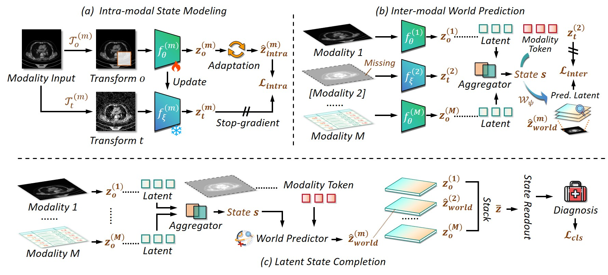

# MoLWM: Towards Missing-Modality Robust Representation Learning with Latent Medical World Modeling

  

    
  

**Feng Wu1, Haohan Zhang2, Pengfei Yang1, Jiati Cai1, Junren Wang2, Fan Zhou1 \*, Jin Yin2 \*, Jing Jing2 \***
<!--   -->
(\* Corresponding author)

1University of Electronic Science and Technology of China, 2West China Hospital, Sichuan University. 

## 📖 Introduction

Existing medical world models have advanced latent predictive representation learning, but they remain largely image-centric and are not designed for incomplete multimodal patient states. 

We propose **MoLWM**, which extends medical world modeling beyond imaging observations by treating missing modalities as unobserved components of a multimodal patient state. MoLWM unifies intra-modal state modeling, target-conditioned world prediction, and latent state completion to infer missing modality-specific evidence from available observations. The completed latent states are then aggregated for diagnosis.

Experiments on three multimodal medical benchmarks show that MoLWM achieves robust and competitive performance under diverse asymmetric and balanced modality-availability settings.

-----

## 🎯 TODO List

- [ ] **Release model code**
- [ ] **Release dataset preprocessing tools**
- [ ] **Release training & Inference pipelines**

## 🤗 Awesome Related Works

[CheXWorld](https://github.com/LeapLabTHU/CheXWorld): CheXWorld explores image world modeling for radiograph representation learning.

[X-WIN](https://github.com/RPIDIAL/X-WIN): X-WIN builds a chest radiograph world model via predictive sensing and latent prediction.
